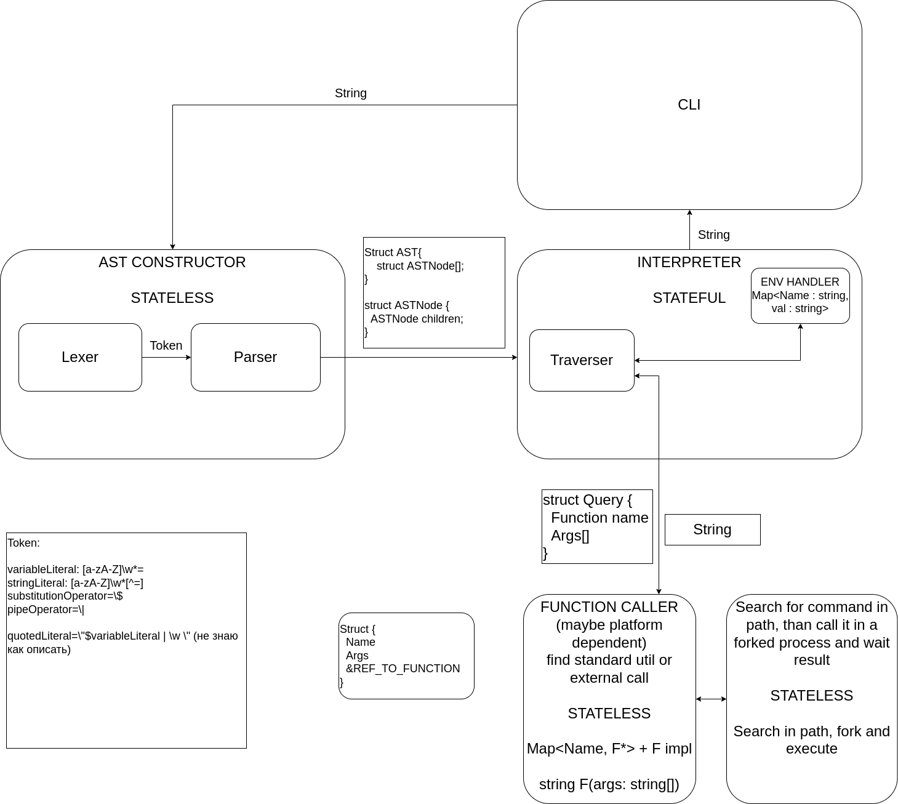

Модули: 
- CLI — сам shell
- AST CONSTRUCTOR — принимает строку и выдает дерево разбора
- INTERPRETER — принимает дерево разбора и проходится по нему, отправляя запросы к модулю вызова функций, и отдает результат выполнения. Хранит в себе состояние
- FUNCTION CALLER — принимает запрос от интерпретатора и отдавая результат их выполнения

AST CONSTRUCTOR:
- Lexer — принимает на вход строку и выдает список токенов
- Parser — принимает на вход список токенов и выдает дерево разбора

Токен и дерево разбора описаны на картинке

INTERPRETER:
- ENV HANDLER — хранит в хэш-таблице по имени переменных окружения их значения
- TRAVERSER — обходит дерево разбора и посылает запросы к FUNCTION CALLER

Хэш-таблица и запросы описаны на картинке

FUNCTION CALLER:
- Хэш таблица с известными функциями
- Реализация известных функций
- Неизвестные функции ищем в PATH и пытаемся исполнить, форкая процесс
